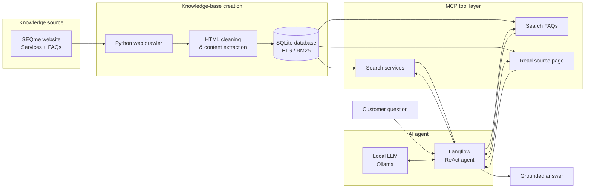

# AI Service Advisor — Local LLM + MCP Knowledge System

**A tool-using AI assistant that answers customer questions using a locally built knowledge base of company services and FAQs.**

This project explores how a **local LLM agent can support customers by reasoning over company-specific information rather than relying only on its pretrained knowledge**.

I built an end-to-end system that:

- **crawls and cleans company service and FAQ pages**
- stores the extracted information in a searchable **SQLite knowledge base**
- performs **full-text/BM25 retrieval**
- exposes the knowledge base through custom **Model Context Protocol (MCP) tools**
- connects those tools to a **ReAct-style agent in Langflow**
- runs the language model locally using **Ollama**
- allows the agent to search for relevant services, retrieve supporting information and answer customer questions

The project was developed as part of an AI course and demonstrates my ability to **learn an unfamiliar technology stack, integrate multiple components and turn them into a working customer-oriented application**.

## What this project demonstrates

- **Rapid adoption of unfamiliar technologies** — MCP, Langflow, local LLMs and agentic workflows
- **Python application development**
- **Tool/API integration**
- **SQL database design and full-text retrieval**
- **Web data extraction and preprocessing**
- **Agentic problem solving**
- **Grounding LLM responses in controlled source information**
- **Customer-oriented software design**
- **Running AI infrastructure locally on Linux/HPC**
- 
## Architecture

# ai_course_3rd_homework
simple ReAct agent that uses SQL database created from www.seqme.eu wbesite and use STDIO MCP tool that access this database to answer customer question

# How to run:
1. on HPC, where llm, langflow, uv and dependencies are installed run:
langflow run \
    --host 127.0.0.1 \
    --port 7860
    
3. on HPC in different terminal:
ollama serve

4. tunnel on local pc:
ssh -L 7860:127.0.0.1:7860 user@xxxx

5. open in canary browser on local pc
http://127.0.0.1:7860

6. have conversation in chat
   
# How to build:
1. on HPC - install dependencies:
cd ~/seqme_service_advisor

uv venv .uv_venv

source .uv_venv/bin/activate

uv pip install langflow

uv pip install \
    requests \
    beautifulsoup4 \
    lxml \
    "mcp[cli]"
    
2. have ollama llm, such as qwen3:14b running locally
3. let the web crawling script to build SQL database from some seqme.eu sites - python src/build_kb.py
4. add the database access module python kb.py, that uses these functions to retrieve information from database: search_services, search_faqs, get_page
5. then create STDIO MCP that use these functions to search database: Search SEQme services, Read SEQme page, Search SEQme FAQs
6. in langflow, use ReAct agent with MCP component as a tool that internally calls the database (they are not connected by line in the workflow)

